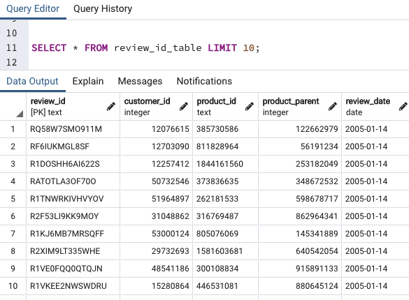
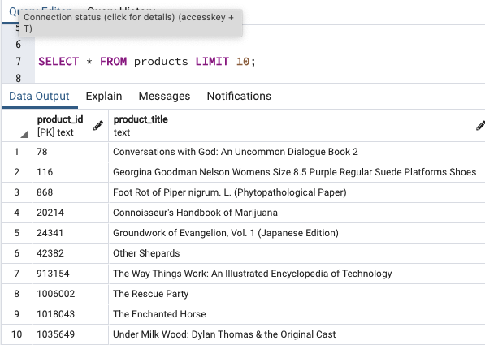
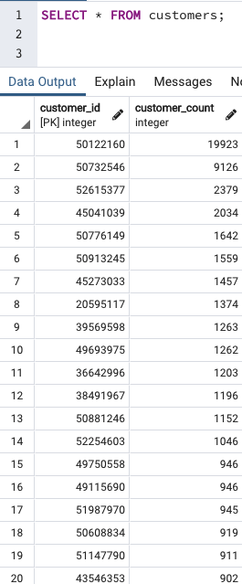
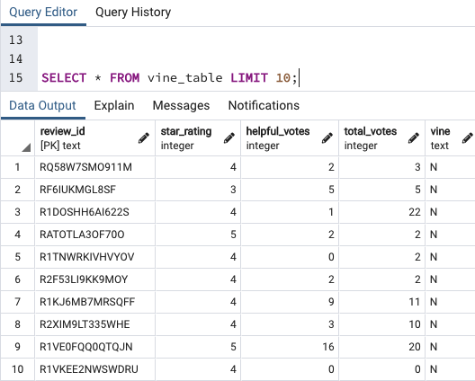
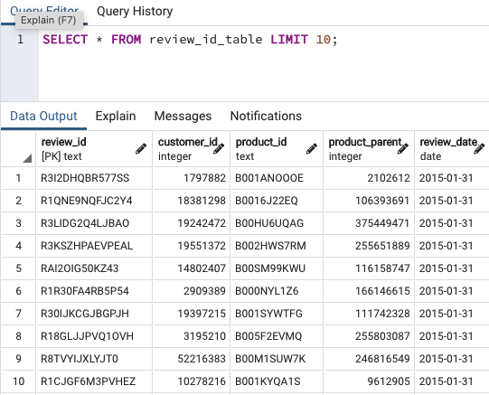
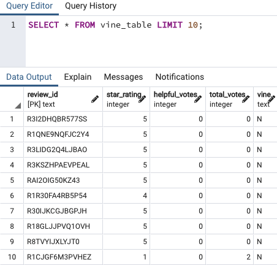

# big-data-challenge: "Alexa, can You Handle Big Data?"
## Level-1

## Objective 
The purpose of this assignment was to use cloud ETL on two of Amazon's customer review datasets, as well as upload a Database to an RDS instance which included four DataFrames to match Amazon's production-ready tables.

## ETL - Book Reviews
### Extract
Extracted 3,105,520 Records

### Transform

### Load

## ETL - Beauty Product Reviews
### Extract
Extracted 5,115,666 Records

### Transform

### Load

